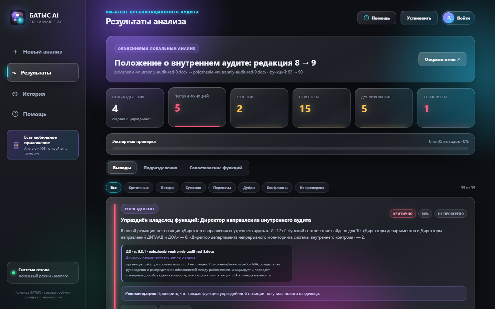

# БАТЫС AI

**Объяснимый ИИ-агент для анализа организационной структуры и функционала.** Кейс HackAlem AI «Анализ организационной структуры и функционала», команда **БАТЫС**.

Агент сравнивает **комплекты документов** «до» и «после» реорганизации: оргструктуры, положения, должностные инструкции, приказы (Word, PDF, Excel). На каждую сторону можно загрузить до 10 файлов. Он определяет созданные, сохранённые, преобразованные и упразднённые подразделения, строит таблицу сопоставления функций, находит потери, сужения, переносы, дублирование и конфликты полномочий. **Каждый вывод подтверждается номером пункта и цитатой** из исходного документа. Окончательное решение принимает эксперт.



**Презентация на одном листе:** [docs/presentation.html](docs/presentation.html). Там схема архитектуры, путь анализа, находки на контрольном комплекте и сверка с ТЗ. Готовый PDF для печати и показа: [docs/batys-ai-presentation.pdf](docs/batys-ai-presentation.pdf).

## Быстрый старт: 1 команда, 1 клик

```bash
git clone https://github.com/BAITC-Hacks/hack-032ef148-team.git
cd hack-032ef148-team
docker compose up --build
```

Откройте <http://localhost:4180> и нажмите **«▶ Положение о внутреннем аудите: редакция 8 → 9»**. Агент проанализирует контрольный комплект организатора примерно за секунду.

<details><summary>Запуск без Docker (Node.js 22+)</summary>

```bash
npm install
npm start          # http://127.0.0.1:4180, хранение в памяти
```

Чтобы использовать PostgreSQL без Docker, укажите `DATABASE_URL` в `.env` (шаблон: [.env.example](.env.example)).
</details>

## Соответствие ТЗ

| Требование ТЗ (Must have) | Как реализовано |
|---|---|
| 1. Какие подразделения реорганизованы, сохранены, созданы | Вкладка **«Подразделения»**: статусы *создано / сохранено / преобразовано / упразднено* с учётом перехода функций. Отдельно выявляются упразднённые позиции-владельцы функций |
| 2. Сопоставить функционал, выявить потерю функций | Вкладка **«Сопоставление функций»**: таблица «пункт ДО ↔ пункт ПОСЛЕ» со статусом и % сходства. Выводы *«Потеря функции»* и *«Сужение функции»* |
| 3. Дублирование и конфликт интересов | Сравнение функций разных владельцев в новой редакции. Типовые обязанности руководителей отфильтрованы. Контрольные функции у двух владельцев помечаются как **конфликт полномочий** |
| 4. Подтверждающий источник для каждого вывода | У каждого вывода есть документ, номер пункта, владелец и цитата. Проверяется автотестом |
| 5. Итоговое аналитическое заключение | Кнопка **«Открыть отчёт»**: печатное заключение с итогом, таблицами и статусами экспертной проверки |
| Ограничение: выводы рекомендательные | Каждый вывод эксперт подтверждает или отклоняет с комментарием. Прогресс проверки виден в интерфейсе и в отчёте |
| Ограничение: без неподтверждённых утверждений | Детерминированное ядро не может сослаться на несуществующий пункт. AI-агент проверяет только готовых кандидатов, а каждая его ссылка на пункт сверяется с документом ([AI-контракт](docs/AI_CONTRACT.md)) |
| Опционально: рекомендации по перераспределению | У каждого вывода есть рекомендация: назначить владельца, развести зоны через RACI, подтвердить передачу |

## Проверка на контрольном комплекте

ТЗ, п. 11: «проверяется, обнаружил ли агент реорганизацию, потерю функции и дублирование и указал ли корректные источники». Результат на `samples/` (редакции 8 → 9):

| Что изменилось в документах | Что нашёл агент | Источник |
|---|---|---|
| Созданы ДИТААД и ДОА | Создано подразделение ×2 | п. 3.4 ред. 9 |
| ДНМ и ДККМ сохранены | Сохранено ×2, указано, сколько функций осталось за каждым | п. 3.4 |
| Упразднена должность «Директор направления внутреннего аудита» | Упразднён владелец функций: 10 из 12 функций перешли к директорам департаментов | п. 5.3 ред. 8 |
| У ДККМ исключены «анализ результатов непрерывного аудита» и «предложения в план работ» | **Потеря функции**: осталась только у ДНМ | п. 5.5.4, 5.5.10 ред. 8 |
| Из отчётности ДККМ выпала периодичность «ежеквартально и по итогам года» | **Сужение функции** | п. 5.5.5 → 5.5.3 |
| Функции директоров департаментов пересекаются с функциями директора ДНМ | Возможное дублирование, конфликт полномочий | п. 5.3.x ↔ 5.4.x ред. 9 |

Эти ожидания зафиксированы в автотесте [`test/analyzer.test.mjs`](test/analyzer.test.mjs):

```bash
npm test     # 11 тестов: контрольный комплект организатора, AI-агент на подставной модели, загрузка комплекта файлов, авторизация и роли, помощь и заключение
```

## Демонстрационный сценарий (5 минут)

1. Главный экран: кнопка **«▶ Положение о внутреннем аудите: редакция 8 → 9»**.
2. Метрики: подразделения, потери, сужения, переносы, дубли, конфликты.
3. Фильтр **«Потери»**: ДККМ 5.5.4 и цитаты «ДО/ПОСЛЕ» рядом.
4. Вкладка **«Подразделения»**: созданы ДИТААД и ДОА, сохранены ДНМ и ДККМ.
5. Вкладка **«Сопоставление функций»**, фильтр «Сужены»: пропавшая периодичность отчётов.
6. Нажать «Подтвердить»: откроется вход эксперта, зарегистрироваться. Подтвердить один вывод и отклонить другой с комментарием, показать подпись эксперта и прогресс проверки.
7. **«Открыть отчёт»**: печатное заключение.
8. Показать то же на телефоне в приложении Expo (или PWA).

В интерфейсе есть раздел **«Помощь»** с пошаговой инструкцией и скриншотами. Там же показан QR-код и адрес для открытия системы на телефоне. В мобильном приложении есть такая же вкладка «Помощь» и ссылка на веб-версию.

Второй набор, **«Синтетический пример»**, показывает упразднение отдела с передачей 2 из 3 функций и потерю антикоррупционной функции.

## Технологии

| Слой | Стек | Почему |
|---|---|---|
| Сервер | Node.js 22+, Express 5, Helmet, rate-limit, JWT (jsonwebtoken), scrypt | Один язык с фронтендом и мобильным приложением, быстрый старт |
| Разбор документов | mammoth (DOCX), pdf-parse (PDF), ExcelJS (XLSX), CSV/TXT | Форматы из ТЗ: Word, PDF, Excel |
| Анализ | Собственный объяснимый алгоритм: русский стеммер, глобальное сопоставление, переход функций | Прослеживаемость и воспроизводимость |
| AI | AI-агент с tool calling: OpenAI или NVIDIA NIM (опционально) | Сам ищет доказательства в документах, ссылки проверяются, решение за экспертом |
| База данных | PostgreSQL 16 (JSONB), резервный режим в памяти | История анализов и решений эксперта |
| Веб | HTML/CSS/JS без фреймворка, PWA | Лёгкий, устанавливается на телефон |
| Мобильное | Expo SDK 57 / React Native, Android и iOS | Один код для двух платформ, запуск через Expo Go |
| Инфраструктура | Docker Compose (app + db), healthcheck | Запуск одной командой |

Подробности: [архитектура и алгоритм](docs/ARCHITECTURE.md) · [AI-контракт](docs/AI_CONTRACT.md) · [безопасность](docs/SECURITY.md) · [мобильные клиенты](docs/MOBILE.md).

## Мобильное приложение (Android и iOS)

```bash
cd mobile
npm install
EXPO_PUBLIC_API_URL=http://<IP-компьютера>:4180 npx expo start
```

Отсканируйте QR-код в **Expo Go**. Возможности: загрузка файлов с телефона, демо в одно нажатие, выводы с цитатами, экспертная проверка, история. Инструкция и сборка APK: [docs/MOBILE.md](docs/MOBILE.md).

## API

| Метод | Путь | Назначение |
|---|---|---|
| GET | `/api/health` | Готовность, режим AI и хранилища |
| GET | `/api/demo` | Список демо-наборов |
| POST | `/api/demo/:id` | Анализ демо-набора (`real`, `synthetic`) |
| POST | `/api/analyses` | multipart: `before` и `after` — **комплекты до 10 файлов** на сторону, `name`, `useAi` |
| GET | `/api/analyses` | История анализов |
| GET | `/api/analyses/:id` | Полный результат: `findings`, `units`, `functionMap`, `summary` |
| PATCH | `/api/analyses/:id/findings/:findingId` | Решение эксперта `{status, comment}`, **нужен вход** |
| GET | `/api/analyses/:id/report` | Печатное заключение (HTML) |
| POST | `/api/auth/signup` · `/signin` · `/logout` | Регистрация, вход (возвращает JWT), выход с отзывом токенов |
| GET | `/api/auth/me` | Текущий пользователь |
| GET · PATCH · DELETE | `/api/users`, `/api/users/:id` | Управление пользователями и ролями (только `admin`) |

## Пользователи и роли

Анализ и просмотр доступны без входа, поэтому демо проверяется в один клик. **Подтверждать и отклонять выводы может только эксперт.** При нажатии «Подтвердить» открывается вход или регистрация, а решение подписывается именем эксперта и попадает в заключение.

| Роль | Права |
|---|---|
| без входа | анализ, демо, просмотр результатов и заключения |
| `expert` | + подтверждение и отклонение выводов с комментарием |
| `admin` | + управление пользователями и ролями. Первый зарегистрированный пользователь становится администратором |

Для постоянного входа задайте `JWT_SECRET` в `.env`. Подробнее: [SECURITY.md](docs/SECURITY.md).

## AI-агент (опционально)

Включается переключателем «AI-агент проверки выводов». По каждому значимому выводу (до `AI_MAX_FINDINGS`, по умолчанию 12, сначала критичные) агент сам ведёт расследование через инструменты:

1. `search_document` — ищет функцию в редакции «до» или «после» (в том числе другими словами, чтобы отличить перенос от потери);
2. `read_clause` — читает найденный пункт целиком;
3. `submit_verdict` — выносит вердикт (подтверждён / сомнителен, уверенность, обоснование, рекомендация) со ссылками на пункты.

Каждая ссылка агента сверяется с документами: несуществующий пункт помечается красным, поэтому выдумать доказательство нельзя. Все шаги агента видны в карточке вывода, окончательное решение остаётся за экспертом.

Провайдер задаётся в `.env`: `OPENAI_API_KEY` (ключ `sk-…` с platform.openai.com, модель `OPENAI_MODEL`) или `NVIDIA_API_KEY` (ключ `nvapi-…` с build.nvidia.com, модель `NVIDIA_MODEL`, по умолчанию `deepseek-ai/deepseek-v4.1-flash`). Ключ другого вида сервер игнорирует. Если ключа нет или произошла ошибка, сохраняется локальный результат. **Основной сценарий работает полностью без ключа.**

## Данные

- `samples/polozhenie-vnutrenniy-audit-red-8.docx`, `…-red-9.docx`: обезличенный контрольный комплект организатора.
- `samples/synthetic/`: синтетический пример, придуман командой, совпадения случайны.

## Ограничения

- Стеммер упрощённый. Для других типов документов (должностные инструкции, приказы) могут понадобиться новые шаблоны заголовков.
- Проверка соответствия внешним нормативам и бенчмаркинг с другими операторами (опциональные пункты ТЗ) не реализованы.
- Авторизация по email и паролю. Для промышленного контура нужны корпоративный SSO, TLS и антивирусная проверка, см. [SECURITY.md](docs/SECURITY.md).
- Мобильное приложение проверено сборкой бандлов Android/iOS и `expo-doctor`. На физических устройствах в рамках хакатона оно не тестировалось.

## Команда и вклад

- **Команда:** БАТЫС
- **Бисенбаев Султан Бекрикулы:** постановка задачи, продуктовая логика, проверка требований ТЗ, демо-сценарий, разработка с использованием AI-агентов (Codex, Claude Code).
